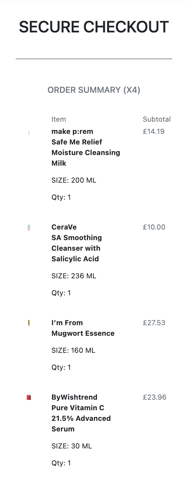

# **S**kin**C**ared

[View Live Website Here](https://skincared.herokuapp.com/)

***
# Introduction

The beauty and cosmetics industry has been an ever growing market since its inception. Worldwide revenue from cosmetics alone were £825 million in 2022. The market is anticipated to grow at a rate of 6.85% each year through 2023 – 2026 showing how lucrative it can be. 

Skincare falls under the category of cosmetic products, which are specifically designed to care and protect the skin. This includes topicals such creams, serums, toners and sunscreen for the body and face; with the most popular products being Korean, Japanese & Western skincare. 

As a result of this demand SkinCared was born. SkinCared is a B2C E-commerce website, focussing in procurement and selling of skincare products from around the world. Specifically SkinCared specialises in Eastern & Western skincare which account for most of the overall market share. 

[Back To Top](#skincared)

# Table Of Contents

1. [Introduction](#introduction)
2. [Site Goals](#site-goals)
    * [Site Goals](#site-goals)
    * [User Goals](#user-goals)
3. [Development Planes](#development-planes)
   * [Strategy](#strategy)
        * [Ideal User](#ideal-user)
        * [Epics](#epics)
        * [User Stories](#user-stories)
    * [Scope](#scope)
    * [Structure](#structure)
    * [Skeleton](#skeleton)
        * [Mockups](#mockups)
        * [Database Schema](#database-schema)
        * [SEO Considerations](#seo-considerations)
    * [Surface](#surface)
    * [Business Model](#business-model)
    * [Social Media Marketing](#social-media-marketing)
    * [Testing](#testing)
    * [Deployment](#deployment)
    * [Credits](#credits)

***
# Site Goals
## Site & User Goals 
### Site Goals
-	To deliver an ecommerce solution for the high demand in skincare products.
- To provide potential and existing consumers a ‘one stop shop’ in skincare, specifically Eastern & Western cosmetics
- To enable SkinCared and its employees to easily update and maintain the overall site and its content, especially the owner/manager
- To generate sales by providing the user an intuitive, hassle free experience in terms of finding, selecting and buying products
- Showcase & promote the wide variety of brands SkinCared houses in terms of their ethos and product selection 

### User  Goals
- Buy skincare products that suite their skins needs or find new ones that intrigue them 
- Learn about the different skin types and products that coincide with said skin type as to build an effective skincare routine 
- Have an seamless user experience in terms on finding, discovering and purchasing skincare products 

[Back To Top](#skincared)

***
# Development Planes 
## Strategy
SkinCared strategy for competing in the saturated skincare market is to provide the user with a singlar point of sale for Eastern & Western skincare products. This coupled with SkinCared ethos for teaching the customer about skincare and the brands it sells makes it unique within the market place. 

### Ideal User 
- Intrest in skincare weather be novice or expert 
- Have a current skincare issue and want a soltion 
- Want to learn more about general skincare or how to aid what is currently afflicting them 
- Someone looking to add to their skincare arsenal 
- Interested in Eastern or Western skincare

## Epics 
9 epics were created which were further developed into  9 User Stories and 47 tasks respectivley. For more details please check the project tab of this repository. 

1. [#12](https://github.com/FarisGJD/skincared/issues/12) Initial workspace setup for early deployment - As a developer, I can **create and setup my workspace in terms of files, folders, packages and applications**, so that I can deploy my workspace early.

2. [#14](https://github.com/FarisGJD/skincared/issues/14)Create home app & base tempalte - As a **user**, I can **check SkinCared's landing page**, so that **I can determine whether the site is suited to my needs and navigate accordingly.**

3. [#16](https://github.com/FarisGJD/skincared/issues/16) Create products (skincare) app - As a **user**, I can **view SkinCared products range**, so that **I can find an item that will fit my needs.**

4. [#18](https://github.com/FarisGJD/skincared/issues/18) Create bag app - As a **user**, I can **add items to my bag and keep them there**, so that **I can purchase now or later.**

5. [#20](https://github.com/FarisGJD/skincared/issues/20)
Create Create checkout app - As a **user**, I can **finalize the checkout process**, so that **I can complete my intended purchase.**

6. [#22](https://github.com/FarisGJD/skincared/issues/22)
Add Stripe, Stripe Elements & Stripe Webhooks functionality - As a **user**, I can **use a secure payment system such as Stripe**, so that **I can feel safe in handing over sensitive information.**

7. [#24](https://github.com/FarisGJD/skincared/issues/24)
Create profile app and customise allauth - As a **user**, I can **signup or login to my SkinCared account**, so that **I can update my personal details and look at my order history.**

8. [#25](https://github.com/FarisGJD/skincared/issues/25)
Add product management functionality - As a **site owner**, I can **manipulate the admin through the site**, so that **I have ease of use.**

9. [#28](https://github.com/FarisGJD/skincared/issues/28)
Add web marketing and seo - As a **site owner**, I can **user SEO and web marketing techniques**, so that **I can target my audience more effectively and precisely.**

## User Stories 
From the Epics 9 User Stories were created and 47 tasks respectively. All predicted tasks and stories were able to be completed as this is the first release of SkinCared and is to act as a minimal viable product with the core functionality in place to achieve said User Stories.

1. ### Initial workspace setup for early deployment 
    * [#13](https://github.com/FarisGJD/skincared/issues/13) As a **developer**, I can **I can setup Django and install the supporting libraries and packages I need**, so that **so I can start the development process.**

2. ### Create home app & base tempalte
    * [#15](https://github.com/FarisGJD/skincared/issues/15) As a **user**, I can **head to the site's landing page and use its navigation menu**so that **I can traverse the website in the hopes of buying something.** 

3. ### Create products (skincare) app
    * [#17](https://github.com/FarisGJD/skincared/issues/17) As a **user**, I can **checkout SkinCareds product lines as well as the brands that they house and more information about skincare**, so that **I can make an informed purchase.**

4. ### Create bag app
    * [#19](https://github.com/FarisGJD/skincared/issues/19) As a **user**, I can **manage and house the items I am interested in purchasing at one location**so that **I can continue to the checkout menu now or in the future.**

5. ### Create Create checkout app
    * [#21](https://github.com/FarisGJD/skincared/issues/21) As a **user**, I can **continue the purchase process from the bag to the checkout**, so that **I can purchase my items.**

6. ### Add Stripe, Stripe Elements & Stripe Webhooks functionality
    * [#23](https://github.com/FarisGJD/skincared/issues/23) As a **user**, I can **make a secure purchase with my card details**, so that **my sensitive information stays private and I can build trust with SkinCared.**

7. ### Create profile app and customise allauth
    *[#24](https://github.com/FarisGJD/skincared/issues/24)As a **user**, I can **signup or log in to an existing account**, so that **I can look at my historical purchases as well as update my contact info.**

8. ### Add product management functionality
    * [#26](https://github.com/FarisGJD/skincared/issues/26) As a **site owner**, I can **perform full CRUD functionality on the server side**, so that **I can manipulate the database easily.**

9. ### Add web marketing and seo
    * [#27](https://github.com/FarisGJD/skincared/issues/27)
    As a **site owner**, I can **include a signup form building my list of contacts and add descriptive meta tags**, so that **I can directly communicate with my consumers and achieve higher rankings in search results.**

[Back To Top](#skincared)

***
# Scope
## Planned Functionality 
* Skincare Products – View full list of the sites products as well as a detailed look at the product when clicked on 

* Product Search – By product type, usage and a search bar that takes extensive search critera such as brand name or ingredient 

* Brands - Look up information about the brands SkinCared hosts, what they are about and their ethos 

* Shopping Bag - A bag where the user can add the items they want to or intend to purchase, as well as upadte or delete them

* Chekout - Securley takes the users delivery and payment information as well as option to save the users delivery details 

* Checkout Success - Informs the user of successful payment and confirms order as well as sends confirmation email

* User Profile - Houses the users information as well as historical orders. User can Create, Read, Update & Delete thier info 

* Login & Singup - Users can create an account, login, logout and signup to a SkinCared account

* Product Management - Site owner can add, update and delete products from the server side 

* Authentication – Different levels of functionality for customer compared to an admin 

* Newsletter Signup Form - The use of a newsletter signup form so that the user can be emailed about promotions 

* Contact Details & Social Media - 

* Feedback - Pop up window with appropriate message for when the user is performing an action on the site 

* Account Recovery - Users can reset their password, email address and delivery address 

[Back To Top](#skincared)

***
# Structure
Since the website uses the Django programming language, the site has an MVC (model, view, template) structure and uses object relational mapping to convert data between the relational databases present. Therefore, the site is divided into apps which then contain the html pages. This makes the structure extreemly inuit

## Main Template 
1. base.html - One of the main 'pages' which holds the header, navbar and footer and newsletter signup form 

## Home App 
2. index.html - Landing page which immediately informs the user what the website is about and its offerings

## Skincare App 
3. all-products.html - Contains a list of all the sites products and when clicked on leads to the products-details.html

4. products-details.html - Contains a detailed view of the product, the brand it comes from and important information such as weather the product is vegan or cruelty free. Furthermore allows the user to add a product to their bag or the admin to update and delete a product 

5. add-products.html - A UI element on the server side that allows the admin to add a product without accessing the admin

6. edit-products.html - A UI element on the server side that allows the admin to edit a product without accessing the admin 

7. brands.html - A page that shows a full list of brand names which when clicked on take you to the full-brands.html page 

8. full-brands.html - Contains detailed information about the brands that are hosted on SkinCared and will contain future functionality that allows user to filter products by brands

9. skin-type.html - Showcases the different skin types and what products would suite said skin type. Again this will have future filtering functionality 

## Bag App 

10. bag.html - A page where the user can store, update and delete current or future purchases ready for the checkout 

## Checkout App 

11. checkout.html -  A page where the user can securely enter the personal and card details as well as the option to save personal details to the profile page 

12. checkout-success.html - A page that appears after the checkout process is complete and confirms to the user the status of the order as well as sends out confirmation emails 

## Profile App 
13. profile.html - A page where the user can find, edit and update their personal information as well as look at thier historical purchases 

## Skincared App 
14. 404.html - A page that pops up when there is a 404 error

[Back To Top](#skincared)
***
# Skeleton

## Mockups 
Mock-ups from similar/competitor E-commerce websites were procured to inform the layout of SkinCared. Typically wireframes would be created but I did not have access to Balsamiq as my subscription expired. Each page mentioned in the mock-ups achieves the goals set out and defined in the structure plane 

### Home Page Mockup 

#### Full Products Mockup 

### Product Details Mockup 

### Full Brands Mockup 

### Brand Details Mockup 

### Skin Type Mockup 

### Bag Mockup 

### Secure Checkout Mockup 

### Secure Checkout Success Mockup 

### User Profile Mockup 

## Database Schema
Since SkinCared is an site that sells skincare products, several relational custom models were used as it was deemed the easiest way to filter through products and map relationships between objects such as a Brands and their Skincare products. In total there are 5 custom models. Due to time constraints only 4 were used. The ones that haven’t been used were purposely left in the code for future releases. 

### Brand 
    - Rows:
            * name - programmatic brand name 
            * freindly_name - friendly brand name 
            * character_identifier - a single letter (e.g. e) used to identify the brand and separate them accordingly 
            * about - description about the brand 
            * image - container the banner image of the brand 
            * slug - used in url's to make them easier to read, but also to     make them more search engine friendly

### Skin Type 
    - Rows:
            * type - name of skin type 
            * description - summary about the skin type containing useful information and suggestions of what product to buy if your skin coincides with said type 
            * image - container a banner image for the specific skin type 
            * slug - used in url's to make them easier to read, but also to     make them more search engine friendly

### Product Type 
    - Rows:
            * name - programmatic product type name 
            * freindly_name - friendly product type name 
            * about - summary about the different product types containing useful information 
            * image - product type banner image 

### Skincare 
    - Rows:
            * brand - has a foreign key relationship with the Brands model
            * about - summary about the brand that the product pertains to 
            * name - name of the product 
            * usage - area of face or body product to be used on 
            * quantity - the size (e.g. ml)
            * price - price of product
            * image - product image 
            * description - summary of what the product is and dose
            * directions - directions on how to use the product 
            * ingredients - full product ingredients list 
            * product_type - has a foreign key relationship with the Product Type model 
            * product_subtype - further details about the product type, programattic name  
            * product_subtype_friendly_name - further details about the product type, friendly name  
            * star_ingredient - list of star ingredient will be used for filtering in future releases 
            * skin_type - many to many relationship with skin type model since one product can be used for many different skin types. Will be used for filtering in future releases 
            * skin_concern - many to many relationship with skin concern model since one product can be used for many skin conc erns. Will be used for filtering in future releases 
            * cruelty_free - cruelty free status 
            * vegan - vegan status 
            * alcohol_free - alchol free status 
            * fragrance_free - fragrance free status 
            * sku - unqiue product number 
            * rating - product rating, will be used in future releases
            
### Skin Concern 
    - Rows:
        * concern - programmatic skin concern name 
        * concern_freindly_name - friendly skin concern name 
        * description - summary about the different types of skin concern containing useful information 
        * image - skin concern banner image 

## SEO Considerations
In order to improve the sites search engine ranks two files were included into the project. The first being sitemap.xml which speeds up content discovery for serach engines as they crawl and index the web application. This was paried with a robots.txt file to signal search engines that they are allowed on the site and may have free access to it. The robots.txt file also tells search engies where they should not go which were defined in the project code (e.g. accounts, bag, profiles etc...)

### Content Strategy 
SkinCared SEO content strategy is to responsibly use heading, strong and emphasis tags were applicable as well as semantic html. Furthermore, specific short tail and long tail keywords were placed and highlighted with said tags throughout the project. The key words were obtained from word tracker, a keyword research tool that allows you to discover what keywords competitors are using. These were then filtered to ones that had relevance, authority and volume. For example, keywords that are high in volume and low in competition. Note keyword stuffing was strictly forgone as this could lower the sites SEO. 

### Keyword Research 
Descriptive meta tags are another way to increase SEO rankings. Within the projects header the keyword meta tag was stuffed with words that had the most relevance, authority and volume. Note keyword stuffing is allowed here. 

[Back To Top](#skincared)
***
# Surface

### Colour Scheme  
The site uses a simple colour pallet consisting of shades of white, black and grey. This was purposefully done as to not distract or deter from the products as they themselves were vibrant in colour. Furthermore, the muted tones make the product images stand out more. To add a pop of colour shades of blue and red were used in giving the user feedback such as hovering over an element. 

### Typography

Two different fonts were used for the site. Raleway was used for the hero image text as to make it stand out. Roboto was used for the rest of the sites text. Both of which are recommended as complementary. 

### Images 
The hero image was aquired from Unsplash and the product images were proqured from Stylevana

## Features 

### Navigation 
The sites navigation can be broken down to two parts. The first and most prevelant being the main navigation which shows up on xl-large, large and medium screen sizes while the mobile navigation appears on medium, small and extra small screens. JavaScript was utilised to display the appropriate navigation drop down when hovered over for the main navigation menu. 

### Footer 
The footer consits of SkinCared contact email, external links notably one of which is to SkinCared Facebook business page and a subscribe button that when clicked on uses JavaScript to reveal a Mailchinp newsletter signup form. As shown in the second image below the signup form gives various feedback to the user when filled out. 

### Homepage
The home or landing page consists of a hero image with text layered over it. It is simple and to the point giving the user an immediate impression of what the site is about. This instant impact is needed as to keep new users attention. Furthermore a shop now button is included to make it even more enticing for the user to shop around.  

### Header 
The header consits of the SkinCared logo, serach bar, user profile, shopping bag and free delivery banner. It is extreemly important for the header to be fully functioning as this is the main way the user can head to the shopping bag, use the serach bar or create an account. Furthermore for the mobile view the serach bar utilises JavaScript so that when the search icon is clicked a serach bar appear below it. 

### All Products 
The all products page displays all of SkinCared skincare in latest order. The page encompasses five products per row for xl, l and m screens and 1 for m, s and xs screens. This layout makes it extreemly easy for the user to know exactly what they are looking at. 

### Product Details 
The product details page opens the product up so that a single one sits center stage and contains a plethora of information about the product. Furthermore here the user has the option to add the product to thier bag or if you are the admin update or delete said product for the databse. 

### All Brands 
The all brands page contains a list of all brand names and iamges. It also has its own navigation system so that when there are hundereds of brands on record it will be easy for the user to navigate the page. 

### Brands Details 
The brand details page contains a banner image of the specified brand and a description of thier history and what they are about. As mentioend previously in future releases this page will also filter the skincare model so that it renders products specific to that brand. For now it serves as a good start. 

### Skin Type 
The skin type page contains a list of all the skin types and a descriotion of what they are about and the best products to use with each. Again in a future release this will also filter the skincare model so that it renders products that are relevant to each skin type. For now this is a good start since the description tells the user which products each skin type needs which they can they just serach for using the serach bar at the top. 

### Shopping Bag 
The shopping bag utilises template logic to render a different layout. If there are no products in the bag then an empty shopping bag will be rendered with a button to keep shopping. If there are products in the bag then a list of products, product information, price, update and remove links will be rendered aswell as a grand total and buttons to either keep shopping or header to the checkout page. This means that the checkout page cant be entered without any products in the bag. 

### Checkout 
The checkout page is broken up into two sections. The first being a checkout summary of the products the user is about to purchase and the second being the user details and secure payment form. 

### Checkout Success
When the user has completed the checkout process the checkout success page is rendered givng the user a summary of what they ordered. An confirmation email is also triggered. 

### User Profile 
The user profile page contains the users saved information as well as their order history. Here the user can update their details. 

### Product Managment
The product management page, only accessible by the admin is a nice UI feature for the admin to manipulate the database from the serverside. 

[Back To Top](#skincared)
***

## Business Model
SkinCared business model is to create, deliver and capture value at every step. It creates value as it is a unique sites that is catering for a gap in the market (one place to shop for Eastern and Western skincare). It delivers and captures value by having a fully functining website that showcases said products and allows and entices the user to keep comming back. 

[Back To Top](#skincared)
***

## Social Media Marketing 
### Facebook Page 
A Facebook business page was created for SkinCared in order to widen its reach. This is beacsuse facebook is a staple in any social media marketing strategy as it has the most users. Furthermore for the most part it is free which is useful for a start up business such as SkinCared. The Facebook page includes links to the main website as to move traffic away from Facebook and over to the site. 

### Newsletter Marketing 
Mailchimp email marketing is used to generate a signup form. This free service allows SkinCared to run, analyse and mange thier newsletter marketing as well as aquires them a list of contacts. 

[Back To Top](#skincared)
***

## Testing
A strategy of mannual testing was implemented for SkinCared. Ideally automated tests would be undergone too but due to time cosntraints this wasent possible. 

### Validator Testing 
All code files HTML, CSS, JavaScript & Python were validated using online and terminal validator tools. All code passed major validation errors with only code generated by other parties producing errors such as Bootstrap. 

### Console Testing
When inspecting the page using Google Chrome some errors appear in the console. As they are comming from external files they were left alone. 

### Lighthouse Testing 
Lighthouse was used to test the landing page. The results came back extreemly well in regards to accessbility and seo but had issues with performance and best practices. The best practices score wasent as high as lighthouse detected console errors which as mentioned before is to do with stripe code which I cant do much about. Next performance was low. This was due to the loading time which the hero image was making slower. That said when testing the live site this dosent effect the perforamnce of the app so was left. 

### Perforamnce Test 
The website was tested on the following devices with no issues: 
* Mackbook Pro 
* Ipad Pro 
* Samnsung Galaxy 
* Galaxy Fold 
* Iphone 8 

### Browser Compatiblity 
The website was tested on the following with no issues 
* Google Chrome 
* Firefox 
* Safari 

### Bugs 
* A major bug that was encountered was to do with stripe webhooks. This is beacuse an webhook secret was set as an environment variable within the workspace dashboard which was causing issues so all environment variables were moved into a env.py file and development set to true which seemed to solve the problem. This was a major issue as if gone uncheked users would not recive an confirmation email informing them about their order status. 

* Another bug was the bootstrap code and table element that was used to make the bag container responsive. The table element dose not particularly do well in columns so a long time was put into figuring out a solution. In the end they text, images and buttons were made smaller which worked but it needs some more attention. 

* Unable to uopdate images for products through the UI server side option. Can only be done through the admin.

* When a quantity of blank is entered into the bag quantity selector, the workspace was throwing errors in production. 

## Technologies Used 
* HTML 
* CSS 
* JavaScript 
* Python 
* Bootstrap
* jQuery 
* Git 
* GitHub
* GitPod
* JSHint 
* Lighthouse 
* W3C Markup Validation 
* W3C Jigsaw CSS Validation 
* flake8 
* Heroku Cloud Application 
* Elephant SQL 
* Django 3.2 
* allauth 
* gunicorn 
* psycopg2 
* dj-database 
* stripe 
* crispy forms 
* aws 

[Back To Top](#skincared)
***

## Deployment 
Heroku was used to deploy the app by following the steps below: 

### Heroku 
1. Create heroku app: 

* Navigate to the heroku website 
* In the heroku browser create an account 
* Active the account by authenticating your email 
* Click the new button to create a new app 
* Enter a unique name for your application 
* Select the closest region to you 
* Click create app 

2. Create the Database: 
* In the Heroku dashbaord click on the resources tab 
* Navigate down to add-ons and seraach for and select Heroku Postgres 

3. Set up environment variables: 
* In the settings tab scroll down to reveal config vars and transfer your environment vairables there 
4.  Set up aws s3 for static and media files storage 

5. Add heroku hostname to allowed hosts variable in the settings.py file 

6. At the top level directory create a procfile adding web: gunicorn app_name.wsgi 

7. Heroku Deployment 
*  Click delopy tab in Heroku 
* In the deployment method section select github and click the connet to github button to confirm
* In the search box enter the Github repo name
* Cick search and then click connect to link the heroku app to the Github repo 

8. Deployment 
* Once development is completed change the debug setting to false in settings.py 
* To manually deploy the Deploy Branch needs to be clicked. The defauly 
*

